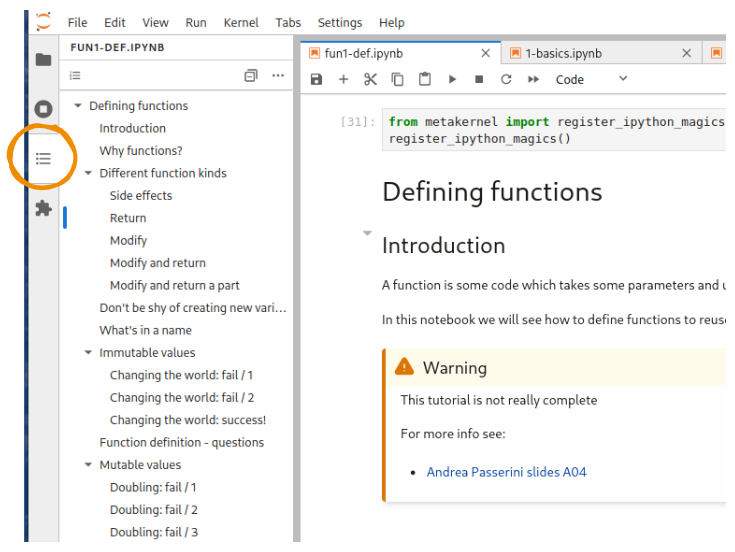

# Working with Jupyter Notebooks

## Run Jupyter Lab

A handy editor you can use for Python is [Jupyter](http://jupyter.org/). Navigate to the course contents, and open Jupyter Lab as follows:

* If you installed Anaconda, you should already find it in the system menu and also in the Anaconda Navigator.
* If you didn't install Anaconda, try searching in the system menu anyway, maybe by chance it was already installed
* If you can't find it in the system menu, you may anyway from command line

Try this:

```bash
cd path/to/course/content
jupyter lab
```

```{warning}
`jupyter` is NOT a Python command, it is a  _system_ command.

If you see written `>>>` on command line it means you must first exit Python insterpreter by writing 'exit()` and pressing Enter !

```

If Jupyter is not installed you will see error messages, in this case you may try installing Jupyter with `pip` (the native package manager of Python) by running:

```bash
    python3 -m pip install --user jupyterlab -U
```

On you managed to start Jupyter, a browser tab should automatically open, and in the console you should see messages like the following ones. In the browser you should see the files of the folders from which you ran Jupyter.

If no browser starts but you see a message like the one here, then copy the address you see in an internet browser, preferably Firefox.

```
$ jupyter lab
[I 18:18:14.669 NotebookApp] Serving notebooks from local directory: /home/da/Da/prj/softpython/prj
[I 18:18:14.669 NotebookApp] 0 active kernels
[I 18:18:14.669 NotebookApp] The Jupyter Notebook is running at: http://localhost:8888/?token=49d4394bac446e291c6ddaf349c9dbffcd2cdc8c848eb888
[I 18:18:14.669 NotebookApp] Use Control-C to stop this server and shut down all kernels (twice to skip confirmation).
[C 18:18:14.670 NotebookApp]

    Copy/paste this URL into your browser when you connect for the first time,
    to login with a token:
        http://localhost:8888/?token=49d4394bac446e291c6ddaf349c9dbffcd2cdc8c848eb888

```

```{warning}
In this case the address is `http://localhost:8888/?token=49d4394bac446e291c6ddaf349c9dbffcd2cdc8c848eb888`, but yours will surely be different!
```

```{warning}
While Jupyter server is active, you can't put commands in the terminal !

In the console you see the server output of Jupyter, which is active and in certain sense 'it has taken control' of the terminal. This means that if you write some commands inside the terminal, these **will not** be executed!

```

## Interacting with a notebook

- To edit a cell, press `Enter` or click inside it.
- To get out of editing mode, press `Escape`, or click outside it.
- To execute Python code inside a Jupyter cell, press `Control + Enter`.
- To execute Python code inside a Jupyter cell AND select next cell, press `Shift + Enter`.
- To execute Python code inside a Jupyter cell AND a create a new cell aftwerwards, press `Alt + Enter`.
- To create a new cell above / below the current one press `A` / `B` (naturally, this doesn't work while editing the cell).
- To delete a cell, select it and press `D` twice.
- To undo a cell operation (such as restore a deleted cell), press `Z`.
- If the notebooks look stuck, try to select `Kernel -> Restart`.


## Saving Jupyter notebooks

You can save the current notebook in Jupyter by pressing `Control-S` while in the browser.

```{warning}
Do not open the same document in many tabs.

Be careful to not open the same notebook in more the one tab, as modifications in different tabs may overwrite at random !  To avoid these awful situations, make sure to have only one tab per document. If you accidentally open  the same notebook in different tabs, just close the additional tab.
```

```{note}
Notebook changes are automatically saved every few minutes.
```


## Turning off Jupyter server

Before closing Jupyter server, remember to save in the browser the notebooks you modified so far.

To correctly close Jupyter, *do not* brutally close the terminal, Instead, from the the terminal where you ran Jupyter, hit `Control-c` twice (that is, hold the `Control` key and press `c` twice).

```
Shutdown this notebook server (y/[n])? y
[C 11:05:03.062 NotebookApp] Shutdown confirmed
[I 11:05:03.064 NotebookApp] Shutting down kernels

```

## Navigating notebooks

To quickly navigate in a notebook, you should use the Table of Contents tab, shown below:




## Doing magic

What actually executes the code you put in notebook cells is called [IPython](https://ipython.readthedocs.io/). And IPython offers a great feature called [magic commands](https://ipython.readthedocs.io/en/stable/interactive/magics.html). They are in two flavours: the line magics, that start with a single `%`, and the cell magics, that start with a `%%`. Here are a few selected examples of the most useful ones:

- [`%pinfo object`](https://ipython.readthedocs.io/en/stable/interactive/magics.html#magic-pinfo), or, equivalently, `object?`, that provide detailed information about an object. For instance, it enables you to see all the arguments of a function or class. So it's extremely useful whenever you discover a new function, or forgot the name of a specific argument you've used before.
- [`%psearch pattern`](https://ipython.readthedocs.io/en/stable/interactive/magics.html#magic-psearch), or, equivalently, `?pattern`, allows you to search for objects available to you. The pattern you provide contains characters to look for, and the so-called *wildcard character* `*` to say: "match anything". For instance, to see all `list` methods that contain the characters `end`, you'd run `?list.*end*`. Extremely useful to remember the name of a function or class you forgot!
- [`%%prun`](https://ipython.readthedocs.io/en/stable/interactive/magics.html#magic-prun) allows you to profile the code run in the same cell. Profiling enables you to identify the parts of your code that takes the most time. It's particularly useful when sorting the output by cumulative time, like so: `%%prun -s cumulative`.
