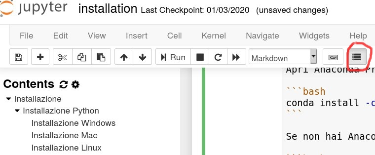

# Working with Jupyter Notebooks

## Run Jupyter Lab

A handy editor you can use for Python is [Jupyter](http://jupyter.org/). Navigate to the course contents, and open Jupyter Lab as follows:

* If you installed Anaconda, you should already find it in the system menu and also in the Anaconda Navigator.
* If you didn't install Anaconda, try searching in the system menu anyway, maybe by chance it was already installed
* If you can't find it in the system menu, you may anyway from command line

Try this:

```bash
cd path/to/course/content
jupyter lab
```

```{warning}
`jupyter` is NOT a Python command, it is a  _system_ command.

If you see written `>>>` on command line it means you must first exit Python insterpreter by writing 'exit()` and pressing Enter !

```

```{warning}
If Jupyter is not installed you will see error messages, in this case don't panic and [go to installation](#Installing-Jupyter-lab---all-operating-systems).

```


A browser should automatically open with Jupyter, and in the console you should see messages like the following ones. In the browser you should see the files of the folders from which you ran Jupyter.

If no browser starts but you see a message like the one here, then copy the address you see in an internet browser, preferebly Chrome, Safari or Firefox.

```
$ jupyter lab
[I 18:18:14.669 NotebookApp] Serving notebooks from local directory: /home/da/Da/prj/softpython/prj
[I 18:18:14.669 NotebookApp] 0 active kernels
[I 18:18:14.669 NotebookApp] The Jupyter Notebook is running at: http://localhost:8888/?token=49d4394bac446e291c6ddaf349c9dbffcd2cdc8c848eb888
[I 18:18:14.669 NotebookApp] Use Control-C to stop this server and shut down all kernels (twice to skip confirmation).
[C 18:18:14.670 NotebookApp]

    Copy/paste this URL into your browser when you connect for the first time,
    to login with a token:
        http://localhost:8888/?token=49d4394bac446e291c6ddaf349c9dbffcd2cdc8c848eb888

```

```{warning}
In this case the address is `http://localhost:8888/?token=49d4394bac446e291c6ddaf349c9dbffcd2cdc8c848eb888`, but youts will surely be different!
```

```{warning}
While Jupyter server is active, you can't put commands in the terminal !

In the console you see the server output of Jupyter, which is active and in certain sense 'it has taken control' of the terminal. This means that if you write some commands inside the terminal, these **will not** be executed!

```

## Interacting with cells

- to edit a cell, press `Enter` or click inside it.
- to get out of editing mode, press `Escape`, or click outside it.
- to execute Python code inside a Jupyter cell, press `Control + Enter`
- to execute Python code inside a Jupyter cell AND select next cell, press `Shift + Enter`
- to execute Python code inside a Jupyter cell AND a create a new cell aftwerwards, press `Alt + Enter`
- to create a new cell above / below the current one press `A` / `B` (naturally, this doesn't work while editing the cell).
- If the notebooks look stuck, try to select `Kernel -> Restart`


## Saving Jupyter notebooks

You can save the current notebook in Jupyter by pressing `Control-S` while in the browser.

```{warning}

Do not open the same document in many tabs.

Be careful to not open the same notebook in more the one tab, as modifications in different tabs may overwrite at random !  To avoid these awful situations, make sure to have only one tab per document. If you accidentally open  the same notebook in different tabs, just close the additional tab.

```

```{note}

Notebook changes are automatically saved every few minutes.

```


## Turning off Jupyter server

Before closing Jupyter server, remember to save in the browser the notebooks you modified so far.

To correctly close Jupyter, *do not* brutally close the terminal, Instead, from the the terminal where you ran Jupyter, hit `Control-c` twice (that is, hold the `Control` key and press `c` twice).

```
Shutdown this notebook server (y/[n])? y
[C 11:05:03.062 NotebookApp] Shutdown confirmed
[I 11:05:03.064 NotebookApp] Shutting down kernels

```

## Navigating notebooks


(Optional) To improve navigation experience in Jupyter notebooks, you may want to install some Jupyter extension, like `toc2` which shows paragraph headers in the sidebar. To install:


Install the [Jupyter contrib extensions](https://github.com/ipython-contrib/jupyter_contrib_nbextensions):


**1a. If you have Anaconda:** Open Anaconda Prompt (or Terminal if on Max/Linux), and type:

```bash
conda install -c conda-forge jupyter_contrib_nbextensions
```

**1b. If you don't have Anaconda:** Open the terminal and type:

```bash
python3 -m pip install --user jupyter_contrib_nbextensions
```

**2. Install in Jupyter:**

```bash
jupyter contrib nbextension install --user
```

**3. Enable extensions:**

```bash
jupyter nbextension enable toc2/main
```

**Once installed**: To see table of contents in a document you will have to press a list button on the right side of the toolbar:



**If by chance you don't see the button:**

1. go to main Jupyter interface
2. check `Nbextensions` tab
3. make sure `Table of Contents(2)` is enabled
4. Close Jupyter, reopen it, go to a notebook, you should finally see the button


## Installing Jupyter lab - all operating systems

If you didn't manage to [find and/or start Jupyter](#Run-Jupyter-lab), probably it means we need to install it!

You may try installing Jupyter with `pip` (the native package manager of Python)

To install, run this command:

```bash
    python3 -m pip install --user jupyter -U
```

Once installed, follow the section [Run Jupyter lab](#Run-Jupyter-lab)
